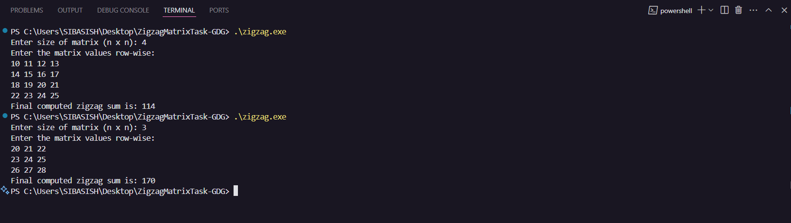
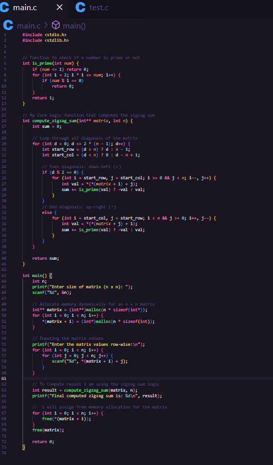

# Zigzag Matrix Traversal Project

This project was built for a coding competition organized by Google Developer Group Bhubaneswar. It solves a zigzag matrix traversal problem in C++, applying prime number logic and pointer-based memory handling. The solution demonstrates efficient algorithm design using dynamic memory allocation and custom prime checking.

## Features
- Zigzag traversal of a matrix with dynamic size.
- Prime number detection to adjust sum calculations.
- Efficient memory management using pointers.

## How It Works
- The program accepts a matrix size (n x n) and its values as input.
- It traverses the matrix in a zigzag pattern, adjusting the sum based on prime number logic.
- Dynamic memory allocation is used to create and manage the matrix.

## Usage
1. Compile the code using a C++ compiler (e.g., `g++ main.c -o zigzag`).
2. Run the executable (e.g., `./zigzag`).
3. Enter the matrix size and values as prompted.
4. View the computed zigzag sum.

## Requirements
- C++ compiler (e.g., GCC).
- Basic terminal interface.

## Screenshot
- Below is a screenshot of the program in action:

 ### 1. Output Section:

 ### 2. Code:
 

## Contributions
This project was developed as part of a competition by GDG Bhubaneswar.
